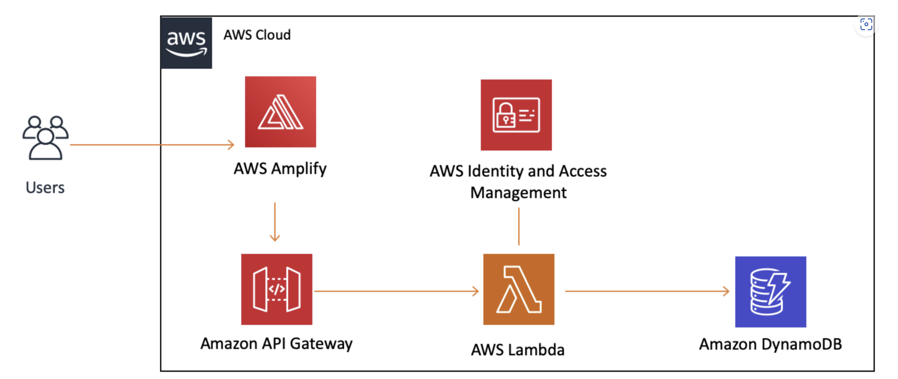

**INFRASTRUCTURE**
    
    The infrastructure below provides a visual representation of the services used in this tutorial and how they are connected. This application uses AWS Amplify, Amazon API Gateway, AWS Lambda, Amazon DynamoDB, and AWS Identity and Access Management (IAM).

    As we go through the tutorial, we will discuss the services in detail and point to resources that will help you get up to speed with them.

