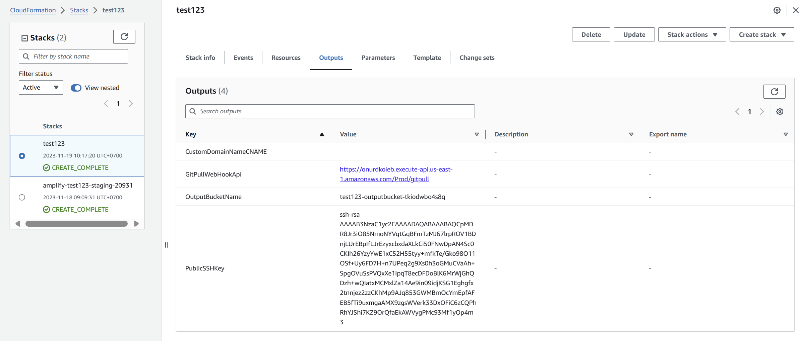
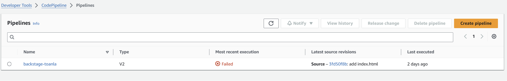
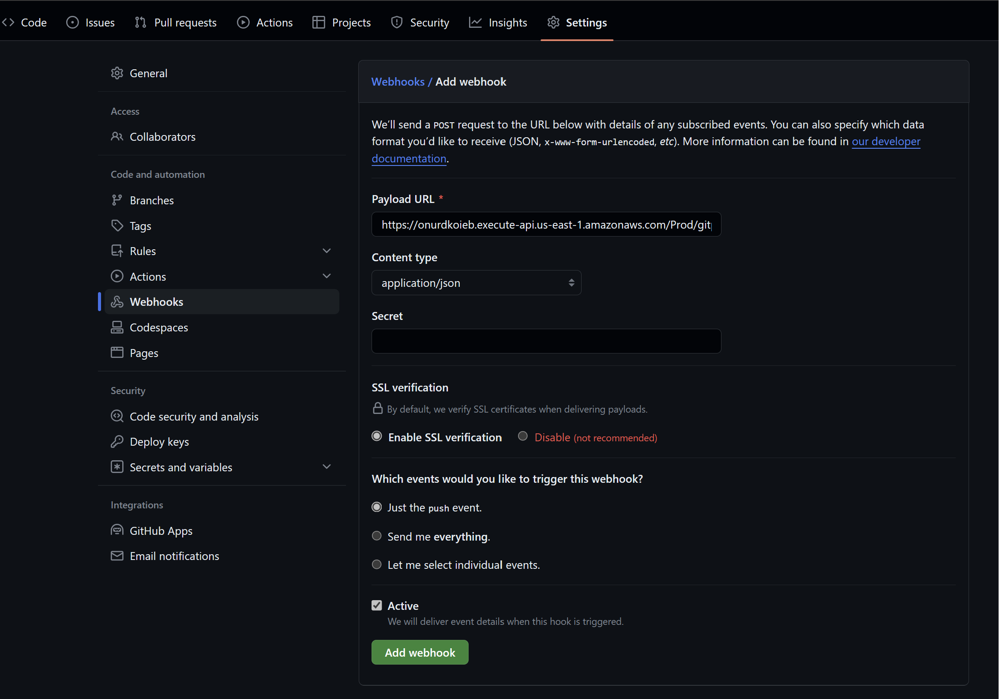
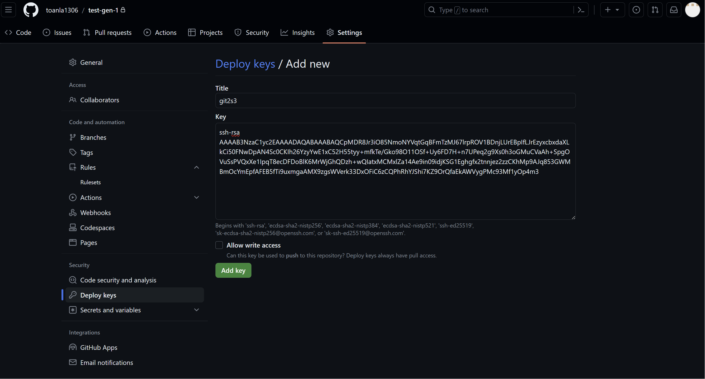
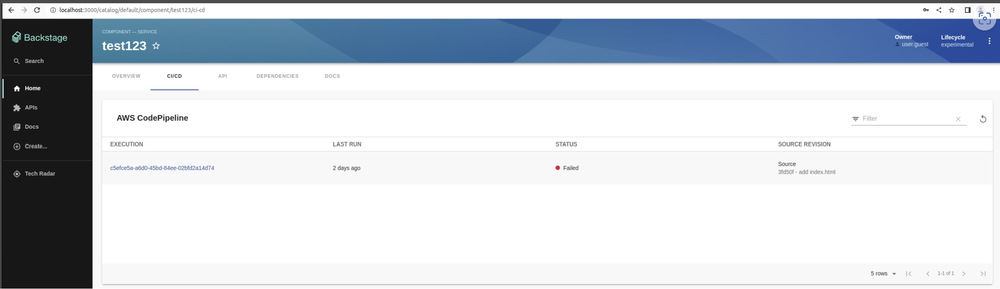

**GUIDE**
    
    1. Waiting Github action is running completely. Then access Cloudformation and Codepipeline to verify the resource is provided.

    2. In output of stack Cloudformation, copy `GitPullWebHookApi` and add that to webhook of repository.

    3. In output of stack Cloudformation, copy `PublicSSHKey` and add that to deploy key of repository.

    
    4. Develop and push code to master branch. We can check status of Pipeline by using Backstage template or Code Pipeline Console AWS

